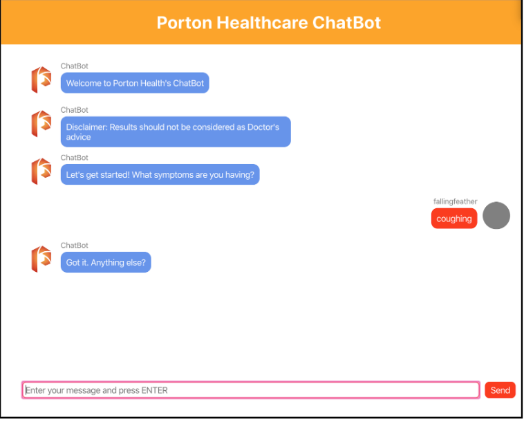

# Machine Learning Health Care Chatbot - Engineering Capstone Project

## Code availible upon request

### Features

- Medical chatbot that gives referral to General Practitioner (GP) and probabilities of different illnesses based on user entered symptoms

- Chatbot will create machine learning models based on datasets provided

- Chatbot will recognize user input mistakes (Word2Vec)

- Utilizes Machine Learning models based off of SVM, Naive Bayes, and Random Forest Classifiers

- Back end computation in Django/Python

- Front end in React.js

## Image of User Interface

